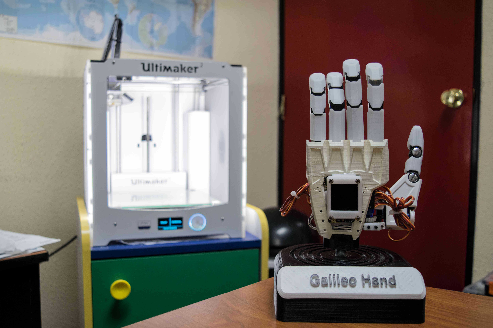

# Galileo Hand 
Galileo Hand is a low-cost 3D-printed prosthetic hand, which is planned to be released as a Do It Yourself kit (DIY), so that people with disabilities could contact local makers to help them to build the system. The prosthesis was designed to be easily built and repaired by anyone with no experience on prosthesis manufacturing anywhere in the world, ensuring its proper operation and removing the need to require expert support. Since, electromyography is a technique used to detect the activity of a group of muscles by measuring bio-potentials acquired by surface mounted electrodes, a controller based on this technique was implemented, allowing the user to consciously perform desired postures on the prosthesis.  Although the complexity of the controller increases the cost of development and fabrication, we are focused to keep the price range below $350 and aiming at a DIY approach where the electronic components could be distributed as a kit which includes the system built on a printed circuit board (PCB), complementing the open source files of the 3D design and the materials to build the prosthesis.

> Galileo Bionic Hand Controller Testing

<iframe width="560" height="315" src="https://www.youtube.com/embed/TJ9j1dAHsXg?list=PLL6NCn-O29eXWlQLxlxE4cLNDKEPnxeVl" frameborder="0" allowfullscreen></iframe>

This controller takes advantage of digital signal processing and machine learning techniques, in order to integrate different systems on a single embedded controller operated through a user-friendly HMI that perfectly adapts on the user lifestyle like a wearable device. This allows the performing of more and
complex customized hand prosthetic actions, such as individual finger movements, different kinds of grasping and time based sequential actions.

##### What do you do through your project?

Provide Open Source software and hardware as a DIY kit, in order to build low cost 3D printed bionic prostheses for below elbow amputees by anyone with no experience on prosthesis manufacturing anywhere in the world.

##### What is the challenge being addressed? Why has it been difficult to resolve this issue to date? Is something innovative?

We propose a hybrid sEMG activated controller with multiple operating modes (Hybrid sEMG-Activated Touch Controller, Hybrid sEMG-Activated Voice Controller and sEMG Pattern Recognition – Machine Learning Technique). This controller takes advantage of digital signal processing and machine learning techniques, in order to integrate different systems on a single embedded controller operated through a user-friendly HMI that perfectly adapts on the user lifestyle like a wearable device. This allows the performing of more and complex customized hand prosthetic actions, such as individual finger movements, different kinds of grasping and time based sequential actions.

##### Is a unique project? What differs from existing similar?

The strict development processes of commercial upper-limb prosthesis and complexity of research projects makes them expensive for end users, both in terms of acquisition and maintenance. The advent of 3D printers and the internet, allows for distributed open-source research projects that follow new design principles; these take into account simplicity without neglecting performance in terms of grasping capabilities, power consumption and controllability. We propose a simple yet functional design based on 3D printing with the aim to reduce cost and save time in the manufacturing process. Its modular, parametric and self-contained design is intended to be fitted in a wide range of people with different transradial amputation levels. Moreover, the system brings an original userfriendly user-prosthesis interface (UPI), in order to trigger and increase the amount of customized hand postures that can be performed by the users. Surface electromyography (sEMG) control allows the user to consciously activate the prosthetic actuation mechanism, a graphical interface enables the possibility to select between different sets of predefined gestures. A five-fingered prosthetic hand integrating intuitive myoelectric control and a graphical UPI was tested, obtaining great mechanical performance, in addition to high accuracy and responsiveness of the sEMG controller.

##### Will it contribute to society, create jobs and improve the quality of life?

Developing countries are known to have under-developed medical and social security systems. This unreliability of medical services leads to people not trusting or not being able to access such services. This in turn leads to people having amputations where it could have been prevented. Also countries like Guatemala have suffered from long term civil wars which have left a large amount of amputees. Such amputees suffer from negative psychological effects, including: depression, low self-esteem, self-image concerns, etc. Socially, they have trouble fitting in due to bullying, marginalization, etc. Our proposed prosthesis aims to help both with aesthetic and functional aspects with low cost of fabrication, so nongovernmental organization or global networks of volunteers can use our designs to help people that need this kind of technology, providing the possibility to create jobs and improving the quality of life of communities.

Links of interest: [Turing Research Lab](turing.galileo.edu) - [ARM Connected Community Blog](https://community.arm.com/iot/embedded/b/embedded-blog/posts/bionic-robohand-prototype---myoelectric-controller-based-on-dsp-and-machine-learning) - [IEEE Xplore](http://ieeexplore.ieee.org/abstract/document/7428468/)

